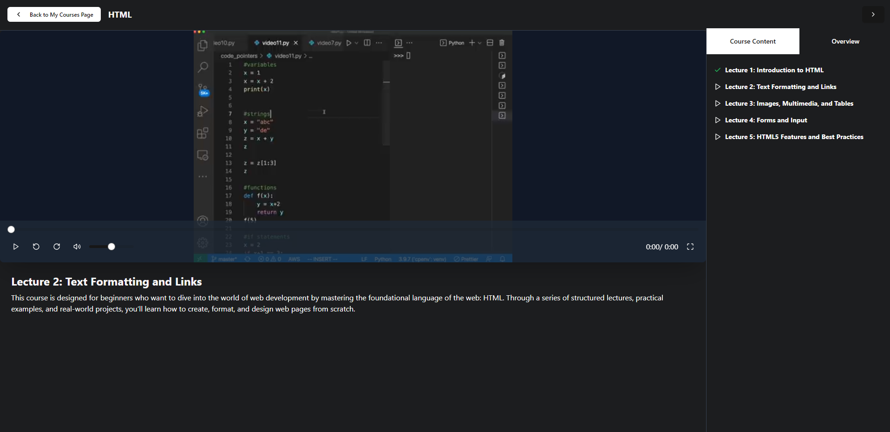
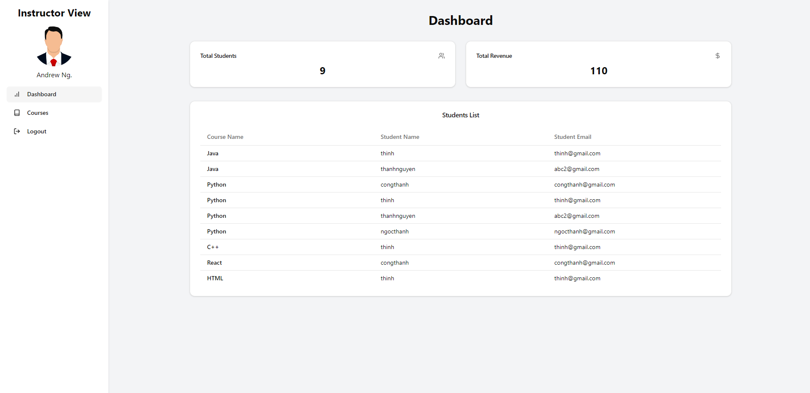

# E-learning website

An interactive e-learning platform with three distinct roles: Student, Instructor, and Admin. The system supports PayPal for secure payments and utilizes Cloudinary for seamless file uploads.

## Role-based

- Admin
- Instructor
- Student

## Tech Stack

    - Front-end: React, Tailwind CSS, ContextAPI, Axios.
    - Back-end: Node.JS, Express.JS, MongoDB.
    - Security: JWT*, accessToken.
    - API: Paypal API, Cloudinary API
    - Tools: Postman, VSCode.

## DEMO

# Students
**Home Page**

**Explore Courses**

**Preview Course**

**Payment Screen**

**Studing Screen**

# Instructors
**Instructor Dashboard**

**Instructor's Courses**

**Add Course**

# Admin

**Admin Dashboard**

**Admin Courses Management**

**Admin Users Management**

